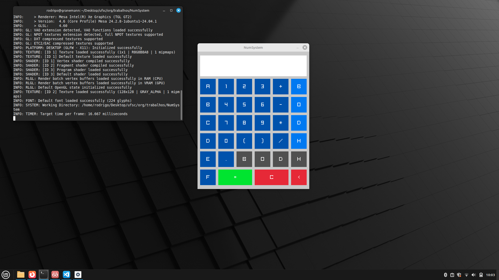

# NumSystem

This is a project made for a college assignment in Computer Architecture and Organization, entirely coded in C, and it functions as a calculator and converter for different number systems, having both text-based and GUI environments.



# How to build it

For text-based mode

```bash
$ git clone https://github.com/pontarolo/NumSystem
cd NumSystem
make text
```

For graphical mode

```bash
$ git clone https://github.com/pontarolo/NumSystem
cd NumSystem
make gui
```